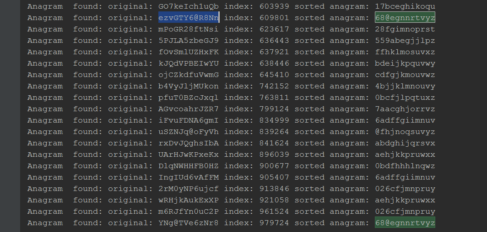

# WEBORAMA Test AZankowitch

## Build
```bash
mvn clean install
```
You will find _ficheri-ID.log_ into target/classes/ 

## Exercice 1

On souhaite localiser dans le fichier tous les doublons présents en indiquant les numéros de ligne où ils apparaissent.

Le programme que vous écrirez (en Java) prendra en argument le chemin du fichier de log, et affichera sur la sortie standard chaque doublon trouvé dans le fichier et les lignes où il a été vu.

Vous fournirez l’algorithme le plus optimal en terme de complexité algorithmique, et fournirez dans votre rapport l’analyse de votre algorithme (ainsi que sa complexité).
### Solution: DuplicateSearch

_Note:_ Le chemin vers le fichier "fichier-ID.log" doit être donné en argument.

Afin de gagner en efficacité on trie les entrées par ordre alphabétique. Ainsi si doublon il y a, ils seront à la suite.
Pour vérifier les doublons on effectue deux boucles imbriquées la première permettra d'avoir l'id à tester, la deuxième testera si l'entrée suivante est identique. Si oui alors on teste la suivante et ainsi de suite.
Nous avons donc un algorithme de complexité O(N2).
## Exercice 2

Même question que l’exercice 1, mais on ne cherche plus les doublons, mais les anagrammes.

La sortie du programme affiche cette fois chaque anagramme trouvée, sous forme de liste groupée, afin d'identifier les anagrammes simplement, ainsi que leur numéro de ligne.

### Solution: AnagramSearch

_Note:_ Le chemin vers le fichier "fichier-ID.log" doit être donné en argument.


On effectue à peu près les mêmes opérations que pour la recherche de doublon. Si ce n'est qu'on va aussi trier les entrées eux-mêmes afin d'obtenir des string "croissante" (ie: abcdefg...). Les anagrammes seront donc les uns à la suite des autres.
Il nous suffit donc de les comparer grâce à une boucle. La méthode n'est pas optimale car le résultat est difficile à lire. En effet si nous sortons bien les anagrammes, il faut faire une recherche dans les résultats pour connaitre les index d’une anagramme. 
ex: 
l'id ezvGTY6@R8Nn (index : 609801) a un anagramme situé à l'index 979724 : YNg@TVe6zNr8
Or sur notre affichage console ces anagrammes ne sont pas à la suite:
 

Ici on effectue une succesion de deux boucles imbriquées, ainsi la complexité est aussi en O(N2).

